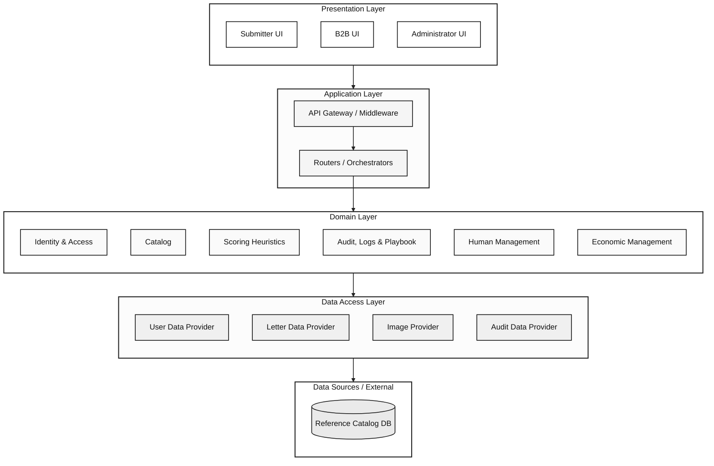

# 🎴 PokéGrading — Sistema Asistido de Pre-Grading

> Sistema de pre-grading asistido para cartas Pokémon que analiza el estado de la carta y estima el grado profesional más probable.

[](https://flutter.dev)
[](https://dart.dev)
[](https://www.postgresql.org)
[](https://docker.com)

---

## 📐 Arquitectura

El proyecto sigue una **Arquitectura en Capas (Layered Architecture)**:



En la estructura de código se sigue dicha estructura de la siguiente forma:

```
layer/
└── module/          # user, submitter_catalog, reference_catalog
    └── feature/     # register, create_card, login, …
```

- **Frontend (delgado):** solo `core/` + `presentation/` — pantalla, provider (`ChangeNotifier`), API y rutas colocalizados por flujo.
- **Backend:** `core/` + `application/` (HTTP routes) + `domain/` (lógica de negocio) + `persistence/` (repositorios, SQL, adaptadores externos).

Ver [docs/adr/refactorDiagramProposal.md](docs/adr/refactorDiagramProposal.md) para el detalle completo.

### Stack Tecnológico

| Capa       | Tecnología                              |
|------------|-----------------------------------------|
| Frontend   | Flutter Web + go_router + ChangeNotifier |
| Backend    | Dart + Shelf                            |
| Base Datos | PostgreSQL 16 + MongoDB 7               |
| Infra      | Docker Compose                          |

---

## ⚡ Inicio Rápido (< 20 minutos)

### Pre-requisitos
- [Docker Desktop](https://www.docker.com/products/docker-desktop/) instalado y ejecutándose
- Conexión a internet para descargar Flutter SDK (~700MB)

### 🐧 Linux / macOS

```bash
# Clonar el repositorio (si aún no lo has hecho)
git clone https://github.com/TechnoBitsSA/PokeGrading-TechnoBitsSA.git
cd PokeGrading-TechnoBitsSA

# Dar permisos y ejecutar el script de instalación
chmod +x scripts/setup.sh
./scripts/setup.sh
```

### 🪟 Windows (PowerShell como Administrador)

```powershell
# En PowerShell como Administrador
cd PokeGrading-TechnoBitsSA
.\scripts\setup.ps1
```

### 🪟 Windows (CMD / Git Bash)

```bat
scripts\setup.bat
```

---

## 🚀 Levantar el Proyecto (Una vez instalado)

> Antes de iniciar el backend por primera vez, ejecuta `dart pub get` dentro de `backend/` para descargar las dependencias de Dart.

## 🗄️ Databases (PostgreSQL + MongoDB)

PostgreSQL stores metadata (users, cards, hashes, pre-grades). MongoDB stores image binaries via GridFS.

On first start with an empty Docker volume, PostgreSQL is initialized from [`backend/db/init/`](backend/db/init/) (`001_schema.sql` then `002_seed_lookups.sql`). MongoDB runs [`backend/db/mongodb/create_pokegrading_images.js`](backend/db/mongodb/create_pokegrading_images.js) automatically when its volume is empty.

Legacy schemas under `backend/db/migrations/` are no longer used by Docker init.

### Windows

```powershell
scripts\db.bat
```

### Linux / macOS

```bash
chmod +x scripts/db.sh
./scripts/db.sh
```

To recreate both databases from scratch, stop and remove volumes first:

```bash
docker compose down -v
docker compose up -d
```

Manual MongoDB init (only if the Mongo volume already existed before adding the init script):

```bash
mongosh "mongodb://localhost:27017/pokegrading_images" backend/db/mongodb/create_pokegrading_images.js
```

### Opción A: Sin Docker (Recomendado para pruebas rápidas / Sin base de datos local)
Asegúrate de tener `USE_MOCK_REPOSITORIES=true` en tu archivo `.env` (ya configurado por defecto).

```bash
# 1. Iniciar el Backend (Dart/Shelf) en Terminal 1
cd backend
dart run bin/server.dart

# 2. Iniciar el Frontend (Flutter Web) en Terminal 2
cd frontend
flutter run -d chrome --web-port 3000
```

### Opción B: Con Docker (PostgreSQL + MongoDB reales)
Asegúrate de tener `USE_MOCK_REPOSITORIES=false` en tu archivo `.env`.

```bash
# 1. Levantar PostgreSQL, MongoDB y pgAdmin. You need to have Docker opened
docker compose up -d

# 2. Iniciar el Backend (Dart/Shelf)
cd backend
dart pub get
dart run bin/server.dart

# 3. Iniciar el Frontend (Flutter Web)
cd frontend
flutter run -d chrome --web-port 3000
```

> El backend estará disponible en: http://localhost:8080  
> El frontend estará disponible en: http://localhost:3000  
> Health check: http://localhost:8080/health

---

# Consulta a DB desde el directorio principal del repo

**PostgreSQL**

```bash
docker exec -it pokegrading_postgres psql -U pokegrading_user -d pokegrading
```
```bash
SELECT id, username, email, registration_date FROM submitter;
```
```bash
\q
```

**MongoDB**

```bash
docker exec -it pokegrading_mongodb mongosh pokegrading_images --eval "db.submitter_images.find().limit(5)"
```

---

## 🎨 Perceptual Hashing (color-aware, multicanal)

El reconocimiento visual de cartas usa hashes perceptuales **color-aware**: en lugar de descartar el color convirtiendo a escala de grises, cada hash se calcula de forma independiente sobre los canales **R**, **G** y **B**, y luego se concatena en un único valor de **192 bits (48 caracteres hexadecimales)**.

- `averageHashHex` (aHash): umbral por canal sobre un resize 8×8 → 3 × 64 bits.
- `differenceHashHex` (dHash): gradiente horizontal por canal sobre un resize 9×8 → 3 × 64 bits.
- `centerAverageHashHex` / `centerDifferenceHashHex`: lo mismo aplicado al recorte central (50%) para reforzar el artwork.
- `edgeHashHex`: aHash sobre la imagen filtrada con Sobel (los tres canales son iguales por construcción, pero se mantiene el mismo shape de 48 chars para uniformidad de almacenamiento y comparación).

La similitud (`ConfidenceScore`) calcula la distancia de Hamming sobre los 192 bits, así que dos artworks con la **misma luminancia pero distinto color** (ej. Psyduck amarillo vs Fuecoco rojo) ya no colisionan como ocurría con los hashes de 64 bits en grises.

> Las columnas `average_hash_hex`, `difference_hash_hex`, `center_average_hash_hex` y `center_difference_hash_hex` en `hash_submitter` / `hash_reference` están declaradas como `varchar(48)`. Si tu volumen de PostgreSQL fue creado con el esquema anterior, recreálo con `docker compose down -v && docker compose up -d` para aplicar el nuevo formato.

Tests:

```bash
cd backend
dart test test/visual_features_test.dart
```

## 📂 Estructura de Directorios

```
PokeGrading-TechnoBitsSA/
├── backend/                        # Servidor Dart + Shelf
│   ├── bin/
│   │   └── server.dart             # Entry point (bootstrap)
│   ├── lib/
│   │   ├── core/                   # config, logging, middleware
│   │   ├── application/            # HTTP routes + DI wiring
│   │   │   ├── app_router.dart
│   │   │   ├── user/
│   │   │   │   └── register_routes.dart
│   │   │   └── submitter_catalog/
│   │   │       └── create_card_routes.dart
│   │   ├── domain/                 # Business logic
│   │   │   ├── user/
│   │   │   │   ├── register/register_logic.dart
│   │   │   │   ├── user.dart
│   │   │   │   └── user_repository.dart
│   │   │   └── submitter_catalog/
│   │   │       └── create_card/create_card_logic.dart
│   │   └── persistence/            # Repositories, SQL, external adapters
│   │       ├── user/
│   │       └── submitter_catalog/
│   └── pubspec.yaml
│
├── frontend/                       # Aplicación Flutter Web
│   ├── lib/
│   │   ├── core/                   # config, theme
│   │   ├── presentation/
│   │   │   ├── app_router.dart     # go_router global
│   │   │   ├── home/
│   │   │   ├── user/register/      # screen + provider + api
│   │   │   └── submitter_catalog/create_card/
│   │   └── main.dart
│   ├── web/
│   └── pubspec.yaml
│
├── docs/
│   └── adr/
│       ├── ADR-001-arquitectura.md
│       └── refactorDiagramProposal.md
│
├── scripts/
│   ├── setup.sh
│   ├── setup.ps1
│   └── setup.bat
│
├── docker-compose.yml
├── .env.example
└── README.md
```

# Estructura frontend:
```
└── presentation/                 # Business logic
    └── module/
        └── feature
            ├── *_screen.dart      # Pantalla / UI: widgets que renderizan la interfaz y manejan la interacción del usuario.
            ├── *_state.dart       # Estado: modelos que representan el estado de la pantalla (valores, etapa del flujo, resultados).
            ├── *_provider.dart    # Provider: `ChangeNotifier` que contiene la lógica de presentación, orquesta acciones y expone el `state` a la UI.
            └── *_api.dart         # API: clientes HTTP que comunican con el backend; convierten respuestas y lanzan excepciones manejables.
```

# Estructura backend:
```
└── backend/lib/                   # Código del servidor
    ├── core/                      # Configuración y utilidades compartidas (logger, config, middleware)
    ├── application/               # Rutas HTTP, wiring de dependencias y adaptadores de entrada (handlers/controllers)
    │   ├── app_router.dart        # Orquestador de rutas y composición de middlewares
    │   └── <module>/_routes.dart  # Mapea endpoints a la lógica de dominio
    ├── domain/                    # Lógica de negocio: entidades, validadores y casos de uso (use-cases)
    │   └── <module>/              # Ej: `create_card_logic.dart` contiene las reglas de negocio del flujo
    └── persistence/               # Adaptadores de datos: repositorios, SQL y proveedores externos
        └── <module>/              # Implementaciones concretas (mock, memory, SQL, SMTP, etc.)
```


---

# MongoDB proposed structure

Connection between PostgreSQL and MongoDB
There's no foreign key or live link between the two databases — card_submitter.id (and card_reference.id) simply acts as a shared key that the application uses to query both. When the app needs a card's images, it takes that bigint ID and queries MongoDB's submitter_images (or reference_images) collection with { card_submitter_id: <id> }, getting back the front and back documents. It's an application-level join, not a database-enforced one.

MongoDB structure

```
pokegrading_images/
├── submitter_images          → metadata docs: {card_submitter_id, side: "front"/"back", file_id, content_type, ...}
├── reference_images           → same idea, keyed by card_reference_id
├── submitter_fs.files/.chunks  → GridFS binary storage (front/back images)
└── reference_fs.files/.chunks  → GridFS binary storage
```

Each card has two metadata documents (one per side), each pointing via file_id to the actual image bytes stored in GridFS. Splitting by origin (submitter/reference) keeps the high-churn user uploads separate from the curated reference set, while the side field + index lets you query front/back together or separately as needed.

---

## 🧪 Verificar que funciona

```bash
# Health check del backend
curl http://localhost:8080/health

# Respuesta esperada:
# {"status":"ok","service":"pokegrading-backend","version":"0.1.0"}
```

---

## 🏪 Probar API B2B (cobertura de catálogo)

La API B2B permite a tiendas (Customers B2B) consultar si cartas existen en el catálogo de referencia **antes** de enviarlas a evaluación. Endpoint: `POST /api/v1/b2b/consult`.

Documentación de diseño: [docs/Sprint_3/ADR-005-Diseño de API B2B.md](docs/Sprint_3/ADR-005-Diseño de%20API%20B2B.md). Ejemplos adicionales: [docs/Sprint_3/B2B-API-Examples.md](docs/Sprint_3/B2B-API-Examples.md).

### Paso 1 — Configurar entorno

1. Copia `.env.example` a `.env` si aún no lo tienes.
2. Para pruebas rápidas sin Docker, usa repositorios en memoria:

```bash
USE_MOCK_REPOSITORIES=true
B2B_DEV_API_KEY=pk_test_b2b_dev_key
```

3. Para pruebas con PostgreSQL real, usa:

```bash
USE_MOCK_REPOSITORIES=false
```

y aplica el esquema/seed B2B en un volumen **nuevo** de Docker:

```bash
docker compose down -v
docker compose up -d
```

Los scripts `backend/db/init/003_b2b_schema.sql` y `004_b2b_seed.sql` crean tablas B2B, un cliente de prueba y cartas en `card_reference`.

### Paso 2 — Iniciar el backend

```bash
cd backend
dart pub get
dart run bin/server.dart
```

Verifica el health check: `curl http://localhost:8080/health`

### Paso 3 — Autenticación

Todas las consultas B2B requieren:

```http
Authorization: ApiKey <tu_api_key>
```

En modo mock o con el seed de desarrollo, la llave de prueba es:

```
pk_test_b2b_dev_key
```

Opcional: `X-Request-Id` (idempotencia) e `If-None-Match` (validación de vigencia vía ETag).

### Paso 4 — Consulta básica (carta cubierta)

```bash
curl -s -X POST http://localhost:8080/api/v1/b2b/consult \
  -H "Authorization: ApiKey pk_test_b2b_dev_key" \
  -H "Content-Type: application/json" \
  -d '{"cards":[{"set":"SVP","number":"001"}]}'
```

Respuesta esperada: `results[0].status` = `COVERED` con `card_id` e `identity` oficiales del catálogo.

### Paso 5 — Coincidencia múltiple

Consulta solo `set` + `number` cuando hay varias variantes activas:

```bash
curl -s -X POST http://localhost:8080/api/v1/b2b/consult \
  -H "Authorization: ApiKey pk_test_b2b_dev_key" \
  -H "Content-Type: application/json" \
  -d '{"cards":[{"set":"SVP","number":"002"}]}'
```

Respuesta esperada: `status` = `MULTIPLE_MATCH` y lista `candidates` ordenada por `card_id`.

### Paso 6 — No cubierta

Carta retirada del catálogo (`active = false` en seed) o inexistente:

```bash
curl -s -X POST http://localhost:8080/api/v1/b2b/consult \
  -H "Authorization: ApiKey pk_test_b2b_dev_key" \
  -H "Content-Type: application/json" \
  -d '{"cards":[{"set":"SVP","number":"003"}]}'
```

Respuesta esperada: `status` = `NOT_COVERED`.

### Paso 7 — Parámetros inválidos (batch parcial)

Una carta inválida no bloquea las demás en la misma consulta:

```bash
curl -s -X POST http://localhost:8080/api/v1/b2b/consult \
  -H "Authorization: ApiKey pk_test_b2b_dev_key" \
  -H "Content-Type: application/json" \
  -d '{"cards":[{"set":"SVP","language":"FR"},{"set":"SVP","number":"001"}]}'
```

Respuesta esperada: primera carta `INVALID_PARAMETERS`, segunda `COVERED`.

### Paso 8 — Idempotencia

Repite la misma petición con el mismo `X-Request-Id`; debe devolver la misma respuesta sin consumir cuota adicional:

```bash
curl -s -X POST http://localhost:8080/api/v1/b2b/consult \
  -H "Authorization: ApiKey pk_test_b2b_dev_key" \
  -H "Content-Type: application/json" \
  -H "X-Request-Id: test-req-1" \
  -d '{"cards":[{"set":"SVP","number":"001"}]}'
```

### Paso 9 — Errores de autenticación

```bash
curl -s -X POST http://localhost:8080/api/v1/b2b/consult \
  -H "Authorization: ApiKey invalid_key" \
  -H "Content-Type: application/json" \
  -d '{"cards":[{"set":"SVP","number":"001"}]}'
```

Respuesta esperada: HTTP 401 con envelope `error.code`, `error.message` y `error.correlation_id`.

### Paso 10 — Tests automatizados

```bash
cd backend
dart test test/b2b_consult_logic_test.dart
```

### Variables B2B relevantes

| Variable | Default | Descripción |
|----------|---------|-------------|
| `B2B_DEV_API_KEY` | `pk_test_b2b_dev_key` | Llave aceptada en modo mock |
| `B2B_RATE_LIMIT_CARDS_PER_MONTH` | `10000` | Límite mensual por cartas consultadas |
| `B2B_IDEMPOTENCY_TTL_SECONDS` | `86400` | Ventana de idempotencia |
| `B2B_MAX_CARDS_PER_REQUEST` | `100` | Máximo de cartas por request |
| `B2B_API_KEY_PEPPER` | vacío | Pepper opcional al hashear llaves |


# Test mas rapido

Correr Docker, backend y frontend como de costumbre y entonces ejecutar en consola:

```bash
Invoke-RestMethod http://localhost:8080/health
```

```bash

$headers = @{
  Authorization = "ApiKey pk_test_b2b_dev_key"
  "Content-Type" = "application/json"
}

$body = '{"cards":[{"set":"SVP","number":"001"}]}'

Invoke-RestMethod -Method POST `
  -Uri "http://localhost:8080/api/v1/b2b/consult" `
  -Headers $headers `
  -Body $body
```

Multiple match (SVP 002):

```bash
$body = '{"cards":[{"set":"SVP","number":"002"}]}'
Invoke-RestMethod -Method POST -Uri "http://localhost:8080/api/v1/b2b/consult" -Headers $headers -Body $body
```

Idempotency:
```bash
$headers["X-Request-Id"] = "test-req-1"
Invoke-RestMethod -Method POST -Uri "http://localhost:8080/api/v1/b2b/consult" -Headers $headers -Body $body
```

Invalid key:
```bash
$badHeaders = @{
  Authorization = "ApiKey invalid_key"
  "Content-Type" = "application/json"
}
try {
  Invoke-RestMethod -Method POST -Uri "http://localhost:8080/api/v1/b2b/consult" -Headers $badHeaders -Body $body
} catch {
  $_.Exception.Response.StatusCode.value__
  $_.ErrorDetails.Message
}
```

---

## 🛠️ Roles de Usuario

| Rol                | Descripción                                    |
|--------------------|------------------------------------------------|
| `Submitter`        | Envía cartas para pre-grading                  |
| `Reviewer`         | Revisa y valida cartas y evaluaciones          |
| `Admin`            | Gestión completa + doble verificación          |
| `B2B Service Account` | Acceso programático vía API Key            |

---

## 📋 Variables de Entorno

Copia `.env.example` a `.env` y ajusta los valores:

```bash
cp .env.example .env
```

For real databases, set `USE_MOCK_REPOSITORIES=false` and configure PostgreSQL (`DB_*`) plus MongoDB (`MONGO_URI`, `MONGO_DB_NAME`).

> Search trace persistence is disabled; `/api/v1/catalog/search-traces` returns an empty list with real repositories.

Para que el token llegue a un correo real, configura también las variables SMTP del backend en `.env`:

```bash
SMTP_HOST=...
SMTP_PORT=587
SMTP_USERNAME=...
SMTP_PASSWORD=...
SMTP_FROM_EMAIL=no-reply@pokegrading.com
SMTP_FROM_NAME=PokéGrading
SMTP_USE_SSL=false
```

Variables B2B (consulta de cobertura de catálogo; ver sección **Probar API B2B**):

```bash
B2B_RATE_LIMIT_CARDS_PER_MONTH=10000
B2B_IDEMPOTENCY_TTL_SECONDS=86400
B2B_MAX_CARDS_PER_REQUEST=100
B2B_API_KEY_PEPPER=
B2B_DEV_API_KEY=pk_test_b2b_dev_key
```

Si SMTP no está configurado, el backend arranca igual pero solo registra el intento en logs y no entrega el correo.
---

## 🤝 Contribución

Ver [docs/adr/ADR-001-arquitectura.md](docs/adr/ADR-001-arquitectura.md) para los lineamientos de arquitectura.
