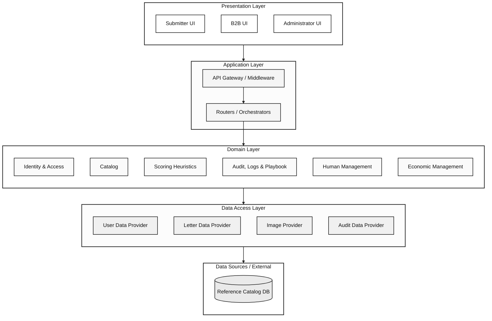

# 🎴 PokéGrading — Sistema Asistido de Pre-Grading

> Sistema de pre-grading asistido para cartas Pokémon que analiza el estado de la carta y estima el grado profesional más probable.

[](https://flutter.dev)
[](https://dart.dev)
[](https://www.postgresql.org)
[](https://docker.com)

---

## 📐 Arquitectura

El proyecto sigue una **Arquitectura en Capas (Layered Architecture)**:



En la estructura de código se sigue dicha estructura de la siguiente forma:

```
layer/
└── module/          # user, submitter_catalog, reference_catalog
    └── feature/     # register, create_card, login, …
```

- **Frontend (delgado):** solo `core/` + `presentation/` — pantalla, provider (`ChangeNotifier`), API y rutas colocalizados por flujo.
- **Backend:** `core/` + `application/` (HTTP routes) + `domain/` (lógica de negocio) + `persistence/` (repositorios, SQL, adaptadores externos).

Ver [docs/adr/refactorDiagramProposal.md](docs/adr/refactorDiagramProposal.md) para el detalle completo.

### Stack Tecnológico

| Capa       | Tecnología                              |
|------------|-----------------------------------------|
| Frontend   | Flutter Web + go_router + ChangeNotifier |
| Backend    | Dart + Shelf                            |
| Base Datos | PostgreSQL 16 (Single Database)         |
| Infra      | Docker Compose                          |

---

## ⚡ Inicio Rápido (< 20 minutos)

### Pre-requisitos
- [Docker Desktop](https://www.docker.com/products/docker-desktop/) instalado y ejecutándose
- Conexión a internet para descargar Flutter SDK (~700MB)

### 🐧 Linux / macOS

```bash
# Clonar el repositorio (si aún no lo has hecho)
git clone https://github.com/TechnoBitsSA/PokeGrading-TechnoBitsSA.git
cd PokeGrading-TechnoBitsSA

# Dar permisos y ejecutar el script de instalación
chmod +x scripts/setup.sh
./scripts/setup.sh
```

### 🪟 Windows (PowerShell como Administrador)

```powershell
# En PowerShell como Administrador
cd PokeGrading-TechnoBitsSA
.\scripts\setup.ps1
```

### 🪟 Windows (CMD / Git Bash)

```bat
scripts\setup.bat
```

---

## 🚀 Levantar el Proyecto (Una vez instalado)

> Antes de iniciar el backend por primera vez, ejecuta `dart pub get` dentro de `backend/` para descargar las dependencias de Dart.

## 🗄️ Base de Datos PostgreSQL

La base se levanta con Docker y se inicializa sola desde [backend/db/migrations/001_initial_schema.sql](backend/db/migrations/001_initial_schema.sql) cuando el volumen está vacío.

### Windows

```powershell
scripts\db.bat
```

### Linux / macOS

```bash
chmod +x scripts/db.sh
./scripts/db.sh
```

Si quieres recrear el esquema desde cero, primero detén y elimina el volumen:

```bash
docker compose down -v
```

### Opción A: Sin Docker (Recomendado para pruebas rápidas / Sin base de datos local)
Asegúrate de tener `USE_MOCK_REPOSITORIES=true` en tu archivo `.env` (ya configurado por defecto).

```bash
# 1. Iniciar el Backend (Dart/Shelf) en Terminal 1
cd backend
dart run bin/server.dart

# 2. Iniciar el Frontend (Flutter Web) en Terminal 2
cd frontend
flutter run -d chrome --web-port 3000
```

### Opción B: Con Docker (PostgreSQL real)
Asegúrate de tener `USE_MOCK_REPOSITORIES=false` en tu archivo `.env`.

```bash
# 1. Levantar PostgreSQL y pgAdmin
docker compose up -d

# 2. Iniciar el Backend (Dart/Shelf)
cd backend
dart pub get
dart run bin/server.dart

# 3. Iniciar el Frontend (Flutter Web)
cd frontend
flutter run -d chrome --web-port 3000
```

> El backend estará disponible en: http://localhost:8080  
> El frontend estará disponible en: http://localhost:3000  
> Health check: http://localhost:8080/health

---

# Consulta a DB desde el directorio principal del repo

```bash
docker exec -it pokegrading_postgres psql -U pokegrading_user -d pokegrading
```
```bash
SELECT id_usuario, username, email, fecha_creacion FROM "USUARIO";
```
```bash
\q
```


## 📂 Estructura de Directorios

```
PokeGrading-TechnoBitsSA/
├── backend/                        # Servidor Dart + Shelf
│   ├── bin/
│   │   └── server.dart             # Entry point (bootstrap)
│   ├── lib/
│   │   ├── core/                   # config, logging, middleware
│   │   ├── application/            # HTTP routes + DI wiring
│   │   │   ├── app_router.dart
│   │   │   ├── user/
│   │   │   │   └── register_routes.dart
│   │   │   └── submitter_catalog/
│   │   │       └── create_card_routes.dart
│   │   ├── domain/                 # Business logic
│   │   │   ├── user/
│   │   │   │   ├── register/register_logic.dart
│   │   │   │   ├── user.dart
│   │   │   │   └── user_repository.dart
│   │   │   └── submitter_catalog/
│   │   │       └── create_card/create_card_logic.dart
│   │   └── persistence/            # Repositories, SQL, external adapters
│   │       ├── user/
│   │       └── submitter_catalog/
│   └── pubspec.yaml
│
├── frontend/                       # Aplicación Flutter Web
│   ├── lib/
│   │   ├── core/                   # config, theme
│   │   ├── presentation/
│   │   │   ├── app_router.dart     # go_router global
│   │   │   ├── home/
│   │   │   ├── user/register/      # screen + provider + api
│   │   │   └── submitter_catalog/create_card/
│   │   └── main.dart
│   ├── web/
│   └── pubspec.yaml
│
├── docs/
│   └── adr/
│       ├── ADR-001-arquitectura.md
│       └── refactorDiagramProposal.md
│
├── scripts/
│   ├── setup.sh
│   ├── setup.ps1
│   └── setup.bat
│
├── docker-compose.yml
├── .env.example
└── README.md
```

# Estructura frontend:
```
└── presentation/                 # Business logic
    └── module/
        └── feature
            ├── *_screen.dart      # Pantalla / UI: widgets que renderizan la interfaz y manejan la interacción del usuario.
            ├── *_state.dart       # Estado: modelos que representan el estado de la pantalla (valores, etapa del flujo, resultados).
            ├── *_provider.dart    # Provider: `ChangeNotifier` que contiene la lógica de presentación, orquesta acciones y expone el `state` a la UI.
            └── *_api.dart         # API: clientes HTTP que comunican con el backend; convierten respuestas y lanzan excepciones manejables.
```

# Estructura backend:
```
└── backend/lib/                   # Código del servidor
    ├── core/                      # Configuración y utilidades compartidas (logger, config, middleware)
    ├── application/               # Rutas HTTP, wiring de dependencias y adaptadores de entrada (handlers/controllers)
    │   ├── app_router.dart        # Orquestador de rutas y composición de middlewares
    │   └── <module>/_routes.dart  # Mapea endpoints a la lógica de dominio
    ├── domain/                    # Lógica de negocio: entidades, validadores y casos de uso (use-cases)
    │   └── <module>/              # Ej: `create_card_logic.dart` contiene las reglas de negocio del flujo
    └── persistence/               # Adaptadores de datos: repositorios, SQL y proveedores externos
        └── <module>/              # Implementaciones concretas (mock, memory, SQL, SMTP, etc.)
```


---

## 🧪 Verificar que funciona

```bash
# Health check del backend
curl http://localhost:8080/health

# Respuesta esperada:
# {"status":"ok","service":"pokegrading-backend","version":"0.1.0"}
```

---

## 🛠️ Roles de Usuario

| Rol                | Descripción                                    |
|--------------------|------------------------------------------------|
| `Submitter`        | Envía cartas para pre-grading                  |
| `Reviewer`         | Revisa y valida cartas y evaluaciones          |
| `Admin`            | Gestión completa + doble verificación          |
| `B2B Service Account` | Acceso programático vía API Key            |

---

## 📋 Variables de Entorno

Copia `.env.example` a `.env` y ajusta los valores:

```bash
cp .env.example .env
```
Para que el token llegue a un correo real, configura también las variables SMTP del backend en `.env`:

```bash
SMTP_HOST=...
SMTP_PORT=587
SMTP_USERNAME=...
SMTP_PASSWORD=...
SMTP_FROM_EMAIL=no-reply@pokegrading.com
SMTP_FROM_NAME=PokéGrading
SMTP_USE_SSL=false
```

Si SMTP no está configurado, el backend arranca igual pero solo registra el intento en logs y no entrega el correo.
---

## 🤝 Contribución

Ver [docs/adr/ADR-001-arquitectura.md](docs/adr/ADR-001-arquitectura.md) para los lineamientos de arquitectura.
