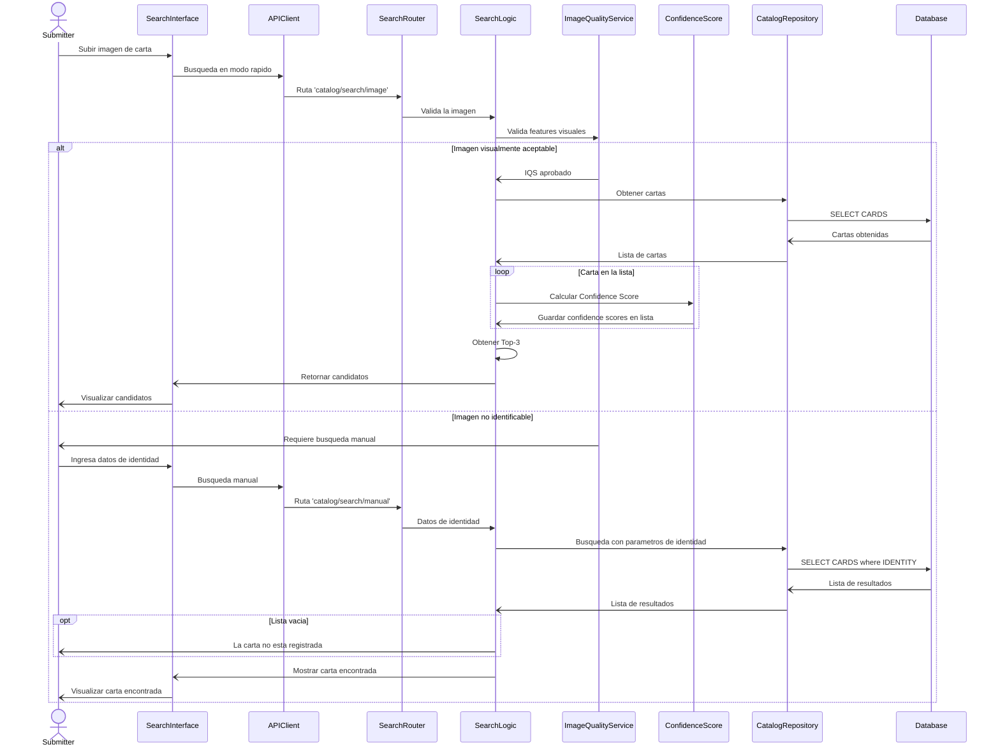

```mermaid
sequenceDiagram

  

actor Submitter

  

actor Submitter

participant UI as SearchInterface

participant Api as APIClient

participant Router as SearchRouter

participant SL as SearchLogic

participant IQS as ImageQualityService

participant CS as ConfidenceScore

participant Repo as CatalogRepository

participant DB as Database

  

Submitter->>UI:Subir imagen de carta

  

UI->>Api:Busqueda en modo rapido

Api->>Router:Ruta 'catalog/search/image'

Router->>SL:Valida la imagen

SL->>IQS:Valida features visuales

  

alt Imagen visualmente aceptable

IQS-)SL:IQS aprobado

SL->>Repo: Obtener cartas

Repo->>DB: SELECT CARDS

DB-)Repo: Cartas obtenidas

Repo-)SL: Lista de cartas

loop Carta en la lista

SL->>CS: Calcular Confidence Score

CS-)SL: Guardar confidence scores en lista

end

SL->>SL: Obtener Top-3

SL-)UI: Retornar candidatos

UI-)Submitter: Visualizar candidatos

else Imagen no identificable

IQS-)Submitter:Requiere busqueda manual

Submitter->>UI: Ingresa datos de identidad

UI->>Api: Busqueda manual

Api->>Router: Ruta 'catalog/search/manual'

Router->>SL: Datos de identidad

SL->>Repo: Busqueda con parametros de identidad

Repo->>DB: SELECT CARDS where IDENTITY

DB-)Repo: Lista de resultados

Repo-)SL: Lista de resultados

opt Lista vacia

SL-)Submitter: La carta no esta registrada

end

SL-)UI: Mostrar carta encontrada

UI-)Submitter: Visualizar carta encontrada

end
```