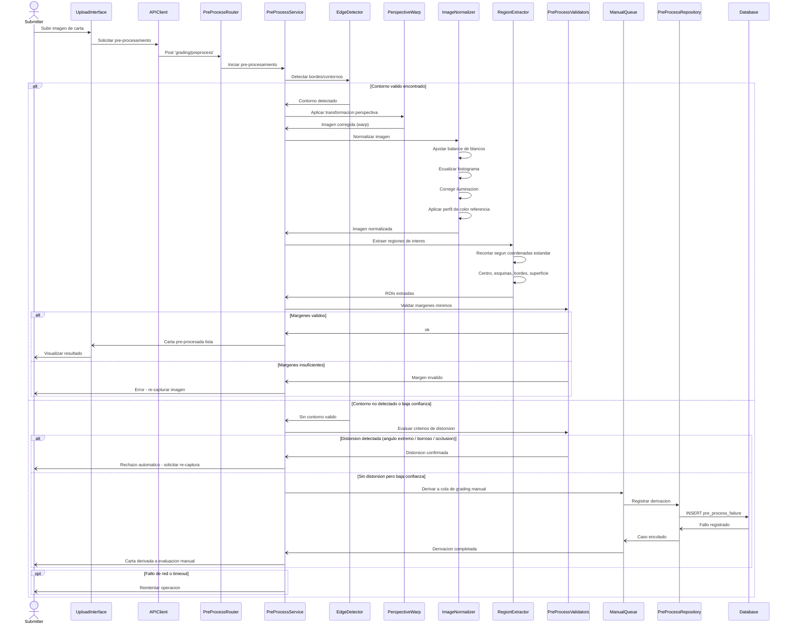

```mermaid
sequenceDiagram

actor Submitter
participant UI as UploadInterface
participant Api as APIClient
participant Router as PreProcessRouter
participant Service as PreProcessService
participant Detector as EdgeDetector
participant Warp as PerspectiveWarp
participant Norm as ImageNormalizer
participant ROI as RegionExtractor
participant Val as PreProcessValidators
participant MQ as ManualQueue
participant Repo as PreProcessRepository
participant DB as Database

Submitter->>UI:Subir imagen de carta
UI->>Api:Solicitar pre-procesamiento
Api->>Router:Post 'grading/preprocess'
Router->>Service:Iniciar pre-procesamiento
Service->>Detector:Detectar bordes/contornos

alt Contorno valido encontrado
Detector-)Service:Contorno detectado
Service->>Warp:Aplicar transformacion perspectiva
Warp-)Service:Imagen corregida (warp)
Service->>Norm:Normalizar imagen
Norm->>Norm:Ajustar balance de blancos
Norm->>Norm:Ecualizar histograma
Norm->>Norm:Corregir iluminacion
Norm->>Norm:Aplicar perfil de color referencia
Norm-)Service:Imagen normalizada
Service->>ROI:Extraer regiones de interes
ROI->>ROI:Recortar segun coordenadas estandar
ROI->>ROI:Centro, esquinas, bordes, superficie
ROI-)Service:ROIs extraidas
Service->>Val:Validar margenes minimos

alt Margenes validos
Val-)Service:ok
Service-)UI:Carta pre-procesada lista
UI-)Submitter:Visualizar resultado
else Margenes insuficientes
Val-)Service:Margen invalido
Service-)Submitter:Error - re-capturar imagen
end

else Contorno no detectado o baja confianza
Detector-)Service:Sin contorno valido
Service->>Val:Evaluar criterios de distorsion

alt Distorsion detectada (angulo extremo / borroso / occlusion)
Val-)Service:Distorsion confirmada
Service-)Submitter:Rechazo automatico - solicitar re-captura
else Sin distorsion pero baja confianza
Service->>MQ:Derivar a cola de grading manual
MQ->>Repo:Registrar derivacion
Repo->>DB:INSERT pre_process_failure
DB-)Repo:Fallo registrado
Repo-)MQ:Caso encolado
MQ-)Service:Derivacion completada
Service-)Submitter:Carta derivada a evaluacion manual
end

opt Fallo de red o timeout
Service-)Submitter:Reintentar operacion
end

end
```
