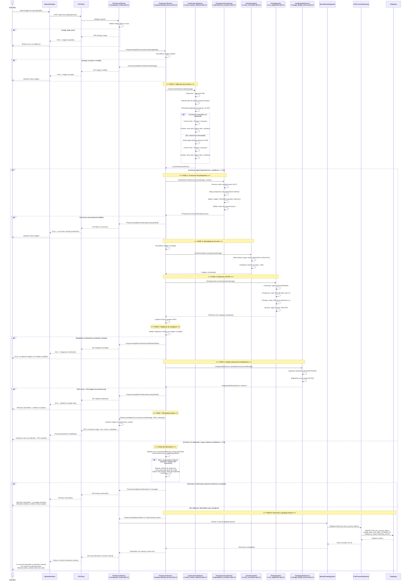

```mermaid
sequenceDiagram

actor Submitter
participant UI as UploadInterface
participant Api as APIClient
participant Router as PreProcessRouter<br/><i>evaluation_routes.dart</i>
participant Service as PreprocessService<br/><i>preprocessing_service.dart</i>
participant Detector as CardContourDetector<br/><i>card_contour_detector.dart</i>
participant Warp as PerspectiveTransformer<br/><i>perspective_transform.dart</i>
participant Color as ColorNormalizer<br/><i>color_normalizer.dart</i>
participant ROI as RoiSegmenter<br/><i>roi_segmenter.dart</i>
participant IQS as ImageQualityService<br/><i>image_quality_service.dart</i>
participant MQ as ManualGradingQueue
participant Repo as PreProcessRepository
participant DB as Database

Submitter->>UI: Subir imagen de carta (base64)
UI->>Api: POST /api/v1/scoring/preprocess
Api->>Router: Delegar request
Router->>Router: Validar image_data no vacio

alt image_data vacio
    Router--)Api: 400 missing_image
    Api--)UI: Error - imagen requerida
    UI--)Submitter: Mostrar error de validacion
end

Router->>Service: PreprocessingService.preprocess(imageData)
Service->>Service: Decodificar imagen base64

alt Imagen corrupta o invalida
    Service--)Router: PreprocessingResult.failure(invalidImage)
    Router--)Api: 422 imagen invalida
    Api--)UI: Error - imagen corrupta
    UI--)Submitter: Solicitar nueva imagen
end

note over Service,Detector: === FASE 1: Deteccion de contorno ===
Service->>Detector: CardContourDetector.detect(image)
Detector->>Detector: Grayscale + Gaussian Blur
Detector->>Detector: Estimar brillo de fondo (muestra bordes)
Detector->>Detector: Threshold adaptativo (margenes 15-100)

alt Contorno encontrado con threshold
    Detector->>Detector: Convex Hull + Extraer 4 esquinas
    Detector->>Detector: Evaluar: area ratio, aspect ratio, confianza
else Sin contorno con threshold
    Detector->>Detector: Sobel edge detection (thresh 15-50)
    Detector->>Detector: Convex Hull + Extraer 4 esquinas
    Detector->>Detector: Evaluar: area ratio, aspect ratio, confianza
end

Detector--)Service: ContourDetectionResult

alt Contorno valido (detected=true, confidence >= 0.3)
    note over Service,Warp: === FASE 2: Correccion de perspectiva ===
    Service->>Warp: PerspectiveTransformer.correct(image, corners)
    Warp->>Warp: Calcular matriz transformacion (DLT)
    Warp->>Warp: Warp perspectiva con interpolacion bilineal
    Warp->>Warp: Salida: imagen 750x1050 (estandar Pokemon)
    Warp->>Warp: Validar matriz de transformacion
    Warp--)Service: PerspectiveCorrectionResult(success)

    alt Correccion de perspectiva fallida
        Service--)Router: PreprocessingResult.failure(processingFailed)
        Router--)Api: 422 fallo en correccion
        Api--)UI: Error - no se pudo corregir perspectiva
        UI--)Submitter: Solicitar nueva imagen
    end

    note over Service,Color: === FASE 3: Normalizacion de color ===
    Service->>Service: Decodificar imagen corregida
    Service->>Color: ColorNormalizer.normalize(cardImage)
    Color->>Color: White balance (gray world, threshold=15, blend=0.6)
    Color->>Color: Histogram stretch (si rango < 200)
    Color--)Service: Imagen normalizada

    note over Service,ROI: === FASE 4: Extraccion de ROI ===
    Service->>ROI: RoiSegmenter.extract(normalizedImage)
    ROI->>ROI: Centering: region central 80%x84%
    ROI->>ROI: 4 Esquinas: crops 15% del lado corto c/u
    ROI->>ROI: 4 Bordes: strips 10% de la dimension c/u
    ROI->>ROI: Surface: region central 70%x76%
    ROI--)Service: RoiResult (10 imagenes separadas)
    Service->>Service: Codificar ROIs a base64 JPEG

    note over Service: === FASE 5: Validacion de margenes ===
    Service->>Service: Validar margenes minimos en imagen corregida

    alt Margenes insuficientes (contenido cortado)
        Service--)Router: PreprocessingResult.failure(invalidAspectRatio)
        Router--)Api: 422 margenes invalidos
        Api--)UI: Error - margenes insuficientes
        UI--)Submitter: Error: re-capturar imagen con margen completo
    end

    note over Service,IQS: === FASE 6: Quality check post-normalizacion ===
    Service->>IQS: ImageQualityService.calculateScore(correctedImage)
    IQS->>IQS: Laplacian sharpness (threshold=60/100)
    IQS->>IQS: Brightness score (rango 80-180)
    IQS--)Service: ImageQualityResult(score, reasons)

    alt IQS score < 60 (imagen borrosa/oscura)
        Service--)Router: PreprocessingResult.failure(processingFailed)
        Router--)Api: 422 calidad insuficiente
        Api--)UI: Error - calidad de imagen baja
        UI--)Submitter: Rechazo automatico - solicitar re-captura
    end

    note over Service: === FASE 7: Resultado exitoso ===
    Service--)Router: PreprocessingResult.success(correctedImage, ROIs, metadata)
    Router->>Router: Guardar imagen en preprocess_output/
    Router--)Api: 200 { corrected_image, rois, corners, metadata }
    Api--)UI: Pre-procesamiento completado
    UI--)Submitter: Visualizar carta normalizada + ROI extraidos

else Contorno no detectado o baja confianza (confidence < 0.3)
    note over Service: === FASE DE RECHAZO ===
    Service->>Service: Mapear error: noContourDetected, contourTooSmall,<br/>contourNotConvex, invalidAspectRatio

    alt Error recoverable (contorno pequeno o aspect ratio incorrecto)
        Service->>Service: Evaluar criterios de distorsion:<br/>- Area ratio fuera de [0.05, 0.98]<br/>- Aspect ratio desvia >40% del esperado<br/>- Confianza < 0.3
    end

    alt Distorsion confirmada (umbral de distorsion excedido)
        Service--)Router: PreprocessingResult.failure(error, message)
        Router--)Api: 422 rechazo automatico
        Api--)UI: Rechazo automatico
        UI--)Submitter: Rechazo automatico - La imagen presenta<br/>distorsion extrema. Solicitar nueva captura
    else Sin distorsion detectable (caso ambiguo)
        note over Service,DB: === FASE 8: Derivacion a grading manual ===
        Service--)Router: PreprocessingResult.failure con flag manual_review
        Router->>MQ: Derivar a cola de grading manual
        MQ->>Repo: Registrar derivacion (pre_process_failure)
        Repo->>DB: INSERT INTO pre_process_failure<br/>(image_data, error_type, correlation_id,<br/>created_at, status='pending_review')
        DB--)Repo: Registro exitoso
        Repo--)MQ: Caso encolado con ID
        MQ--)Service: Derivacion completada
        Service--)Router: Resultado con manual_review=true
        Router--)Api: 202 carta derivada a revision manual
        Api--)UI: Carta en cola de evaluacion manual
        UI--)Submitter: Tu carta fue derivada a evaluacion manual.<br/>Un revisor la evaluara pronto.<br/>Mientras tanto, puedes subir otra carta.
    end
end
```
