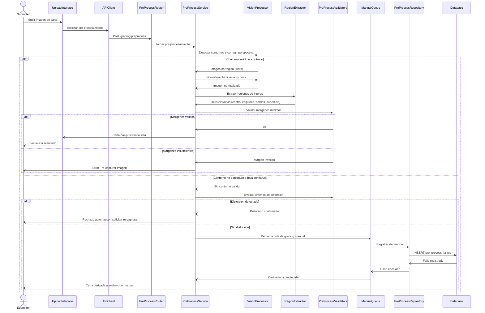

```mermaid
sequenceDiagram

actor Submitter
participant UI as UploadInterface
participant Api as APIClient
participant Router as PreProcessRouter
participant Service as PreProcessService
participant Vision as VisionProcessor
participant ROI as RegionExtractor
participant Val as PreProcessValidators
participant MQ as ManualQueue
participant Repo as PreProcessRepository
participant DB as Database

Submitter->>UI:Subir imagen de carta
UI->>Api:Solicitar pre-procesamiento
Api->>Router:Post 'grading/preprocess'
Router->>Service:Iniciar pre-procesamiento
Service->>Vision:Detectar contornos y corregir perspectiva

alt Contorno valido encontrado
Vision-)Service:Imagen corregida (warp)
Service->>Vision:Normalizar iluminacion y color
Vision-)Service:Imagen normalizada
Service->>ROI:Extraer regiones de interes
ROI-)Service:ROIs extraidas (centro, esquinas, bordes, superficie)
Service->>Val:Validar margenes minimos

alt Margenes validos
Val-)Service:ok
Service-)UI:Carta pre-procesada lista
UI-)Submitter:Visualizar resultado
else Margenes insuficientes
Val-)Service:Margen invalido
Service-)Submitter:Error - re-capturar imagen
end

else Contorno no detectado o baja confianza
Vision-)Service:Sin contorno valido
Service->>Val:Evaluar criterios de distorsion

alt Distorsion detectada
Val-)Service:Distorsion confirmada
Service-)Submitter:Rechazo automatico - solicitar re-captura
else Sin distorsion
Service->>MQ:Derivar a cola de grading manual
MQ->>Repo:Registrar derivacion
Repo->>DB:INSERT pre_process_failure
DB-)Repo:Fallo registrado
Repo-)MQ:Caso encolado
MQ-)Service:Derivacion completada
Service-)Submitter:Carta derivada a evaluacion manual
end
end
```
